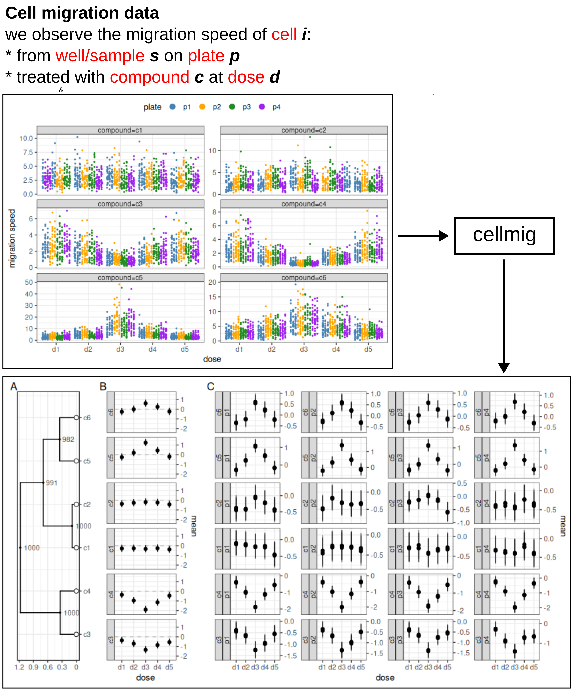

# cellmig

Quantification of cell migration speed with Bayesian probability models

## Overview

Cell imaging enables us to profile the migration speeds of cells under various 
treatment conditions, such as different chemical compounds at varying doses, 
and across distinct biological states, like cancerous versus healthy cells. 
However, these experiments are typically costly, which limits the number of 
biological replicates that can be included. Additionally, cell migration 
readouts are often noisy and susceptible to batch effects. As a result, the 
estimates of cell migration speeds tend to be highly uncertain, a challenge 
further exacerbated by the use of suboptimal statistical methods.

cellmig addresses these issues by implementing hierarchical Bayesian models 
designed to handle noisy and sparse cell migration data. It accounts for 
potential batch effects and provides robust quantitative estimates of cell 
speeds in each sample, while also facilitating differential migration analysis 
across different treatments. Additionally, cellmig includes tools that assist 
in planning future experiments, answering critical questions such as: "How many 
replicates and cells are needed to reliably detect a given effect?"

## How to use cellmig

scBubbletree is an R-package

<https://github.com/snaketron/cellmig>

To install this package, start R and enter:

``` r
library("devtools")
devtools::install_github("snaketron/cellmig")
```

Case studies are provided in the directory /vignettes

## Workflow & output


